## 프로젝트 타이틀 : Eody

> 만남 장소 추천 웹 애플리케이션

### 프로젝트 주제 및 내용

* **만남 장소 추천 플랫폼 서비스**

* 사람간 만남 약속에 앞서 참석 인원들의 거리, 목적 등 여러 요인을 고려하여 만남 장소를 선정하기 어려운 문제를 발견했습니다. 이에 **장소 탐색을 원하는 고객, 장소를 운영하는 사업자를 중개하는 웹 애플리케이션**을 개발하고자 합니다.

* **장소를 탐색하는 고객**에게는 **3가지 시나리오\***에 해당하는 지역 및 장소 추천 기능, 장소 상세 정보와 리뷰, 평점, 예약 기능을 제공합니다.

- 참석자 거리 우선 탐색, 내 위치 주변 탐색, 구체적 희망 지역 탐색

*  **장소를 운영하는 사업자**에게는 장소 관리/광고/통계 기능, 사업관리 지식 콘텐츠 열람, 예약/리뷰 관리 기능을 제공하고, 플랫폼 전체 장소 데이터 입출력을 연동합니다.

### 팀원간 역할 분담 및 일정

### 시스템 구성도

### 사용 기술

### ERD

### 핵심 기능

#### 1. 회원가입 기능

  #### 1-1. 아이디 중복 체크

  * 사용자(SEARCHER)의 아이디가 이미 가입되어 있다면 `이미 사용 중인 아이디입니다.`라는 문구를 표시

  

  * 사용자(SEARCHER)의 아이디가 가입되어 있지 않다면 `사용 가능한 아이디 입니다.`라는 문구를 표시

  

  #### 1-2. 비밀번호 확인

  * 사용자(SEARCHER)의 비밀번호 입력을 이중으로 받아 두 개의 비밀번호가 같을 시 `비밀번호가 일치합니다!`라는 문구를 표시

  

  * 사용자(SEARCHER)의 비밀번호 입력을 이중으로 받아 두 개의 비밀번호가 다를 시 `비밀번호가 다릅니다!`라는 문구를 표시

  

#### 2. 거리우선탐색 구현 방안

> (`장소탐색 고객`) 참석자 거리 우선 탐색 알고리즘

##### 1) 참석자들의 위도와 경도 입력

##### 2) 참석자 좌표와 Rawdata 두 점의 거리 계산 반복

##### 3) Rawdata별 참석자 좌표들과의 평균 거리 계산

##### 4) 참석자들의 출발지를 제외한 상위 3개 지역 반환

#### 3. Searcher/Myroom

> JSTL의 forEach, choose 구문을 활용
> 예약 데이터의 상태(Shop 운영자의 승인)에 따라 동적으로 예약 데이터 Display.

#### 4. Searcher/Review 작성

> multipartFile 을 활용한 리뷰 작성 내 여러 이미지 파일 업로드 처리

#### 5. Searcher/Myroom Review List

> Ajax를 이용한 JSON 비동기 데이터 송수신

#### 6. 기상청 외부 API

> 기상청 API로 날씨데이터를 주기적으로 요청하여 화면 Display

#### 7. 카카오지도 외부 API

> Searcher에 의해 선택된 지역(지하철역)의 지도 Display & 마커 표시

### 화면 구성

#### * SEARCHER

##### - 메인

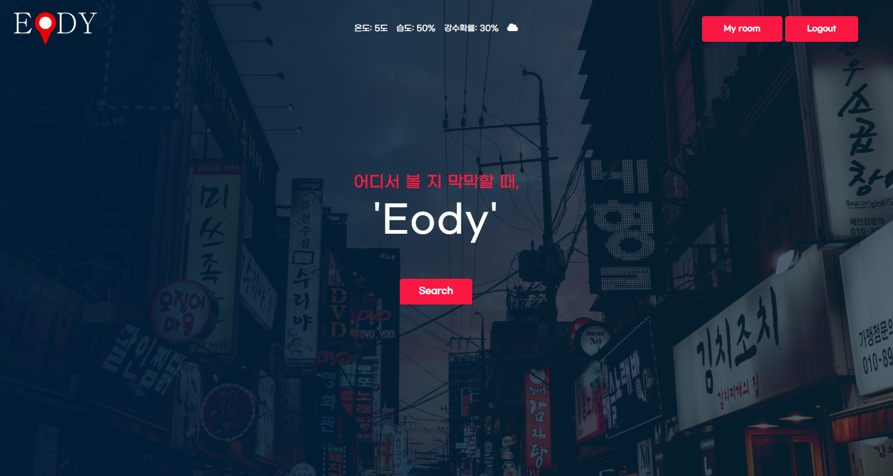

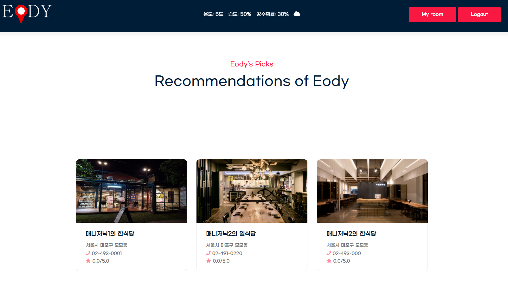

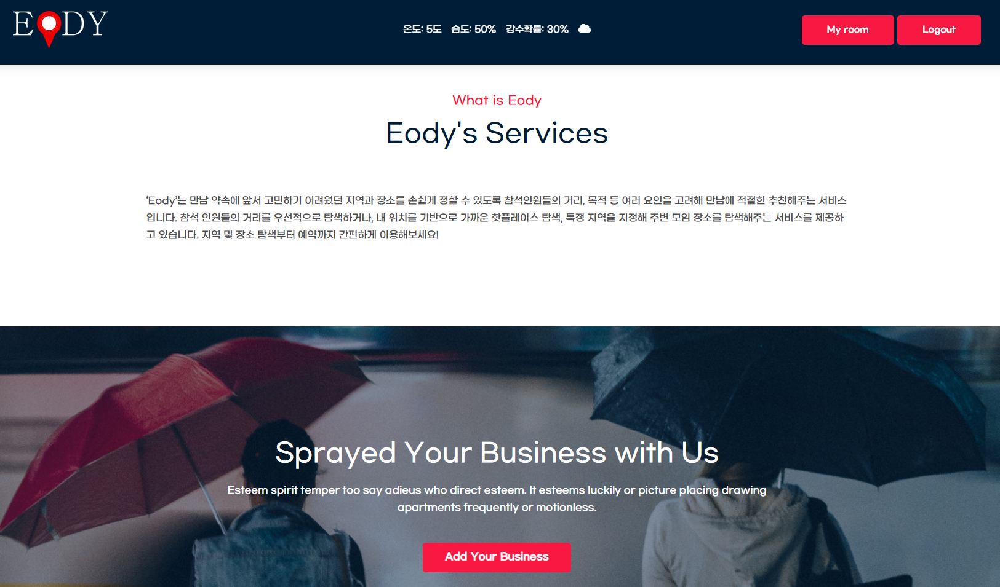

##### - 로그인

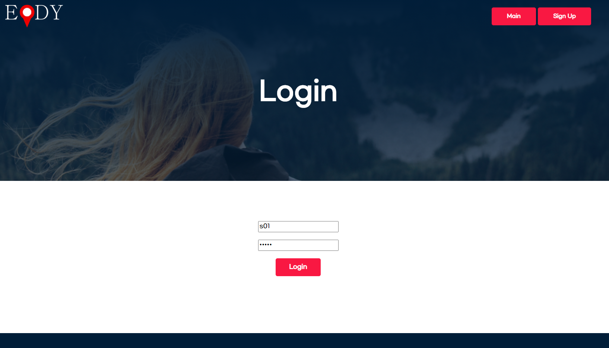

##### - 회원가입

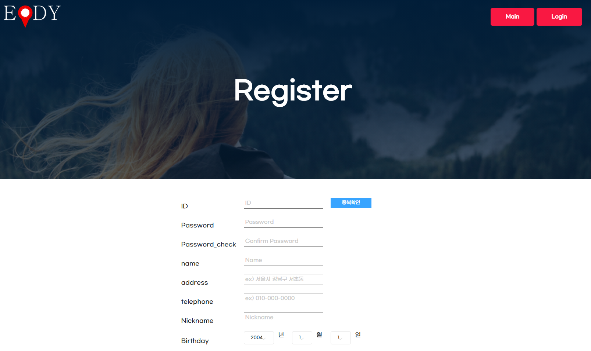

##### - 지역 및 모임 추천을 위한 정보 입력

##### - 중간 지점으로 찾기

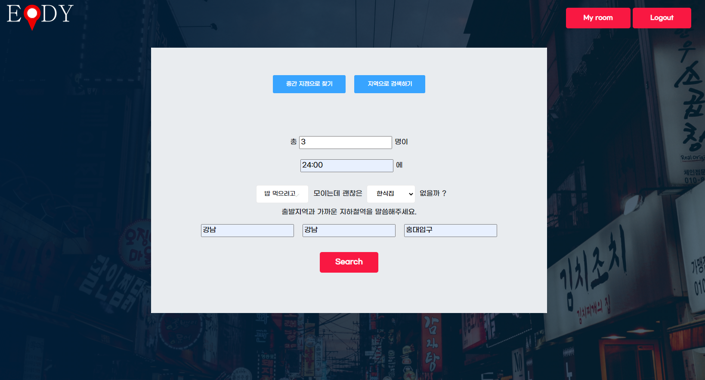

##### - 지역으로 검색하기 결과

##### - 지역 추천 

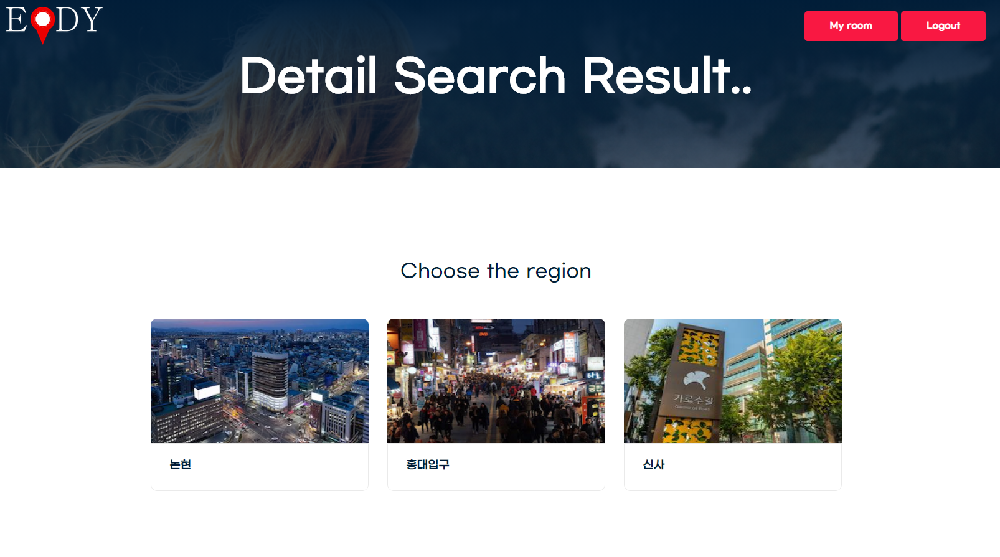

##### - 지역 내 장소 추천 

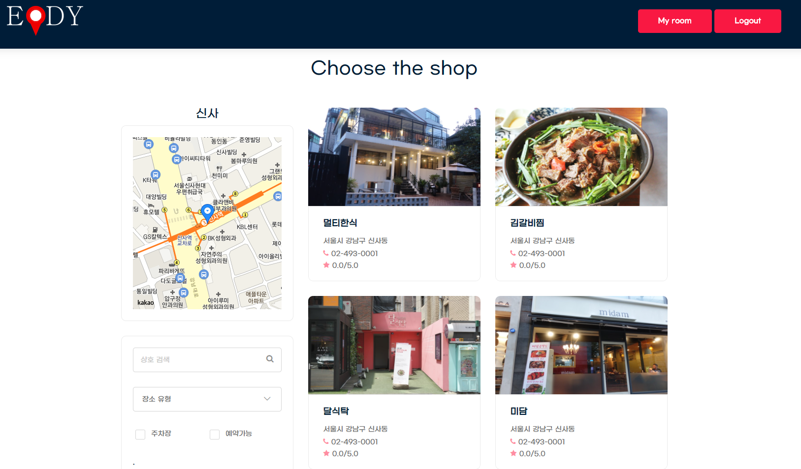

##### - 상호검색

##### - 장소 상세 및 예약

##### - Myroom (예약내역 확인)

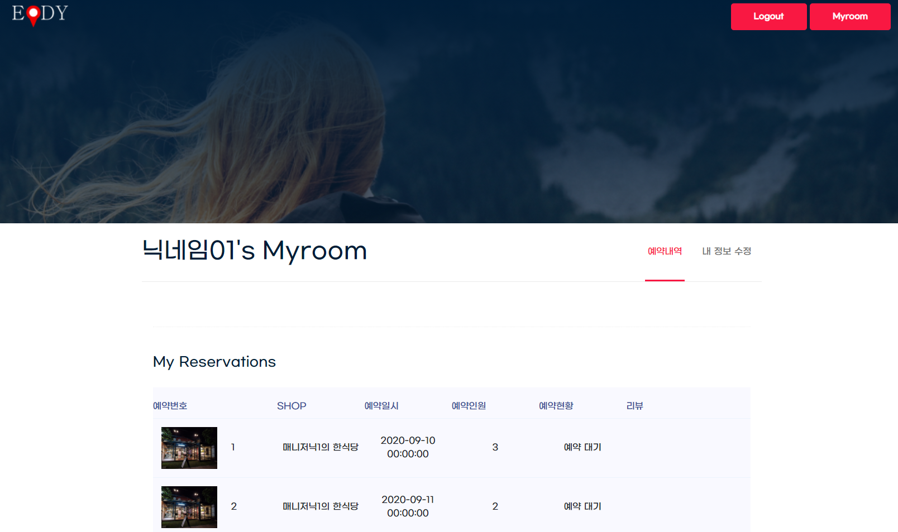

##### - Myroom (리뷰 쓰기)

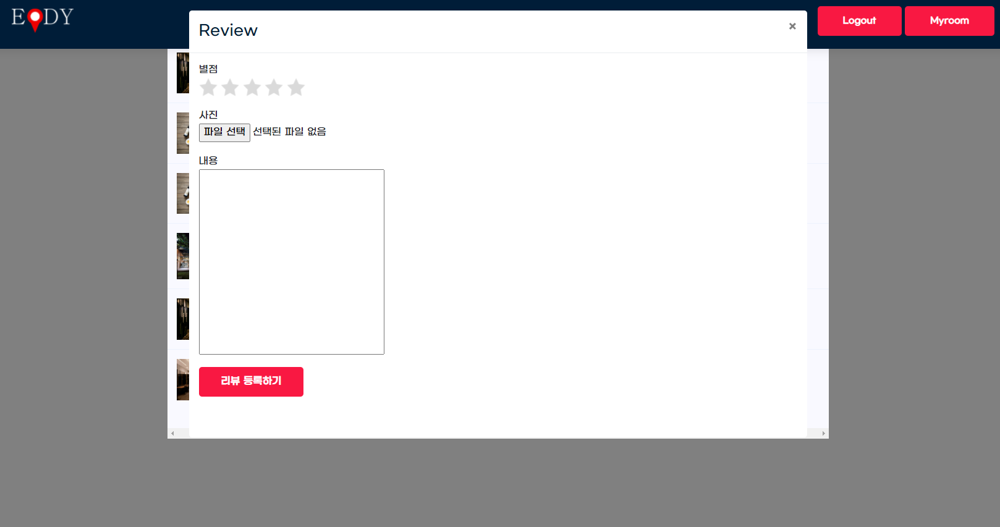

##### - Myroom (내 정보 수정)

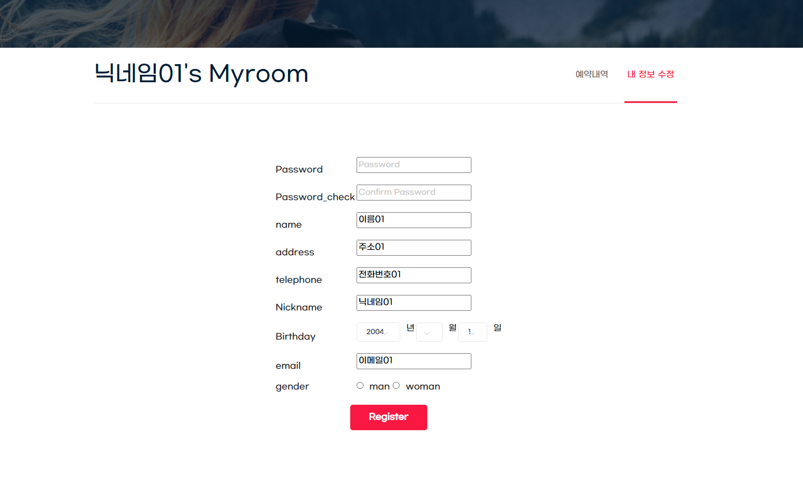

#### * MANAGER

##### - 메인

##### - 로그인

##### - 로그인 성공 시 메인

##### - 가게 업로드

##### - 가게 등록 후 메인

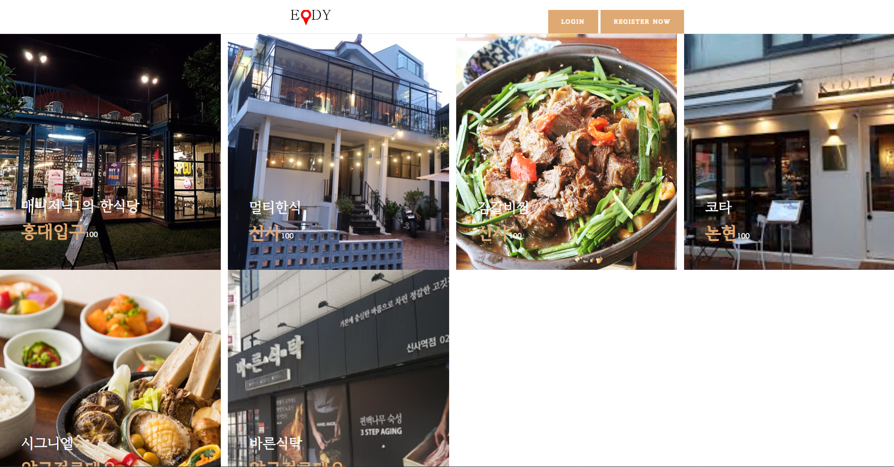

##### - 가게 상세

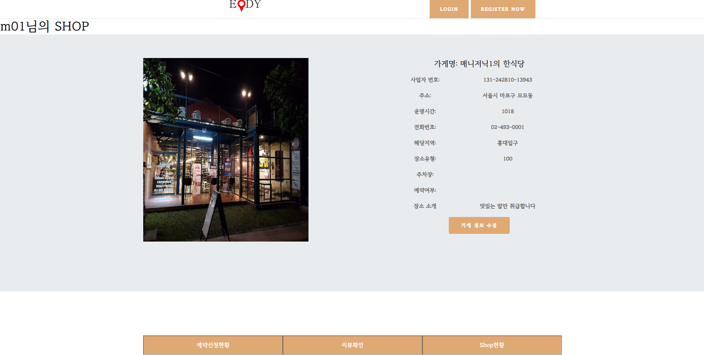

##### - 가게 정보 수정

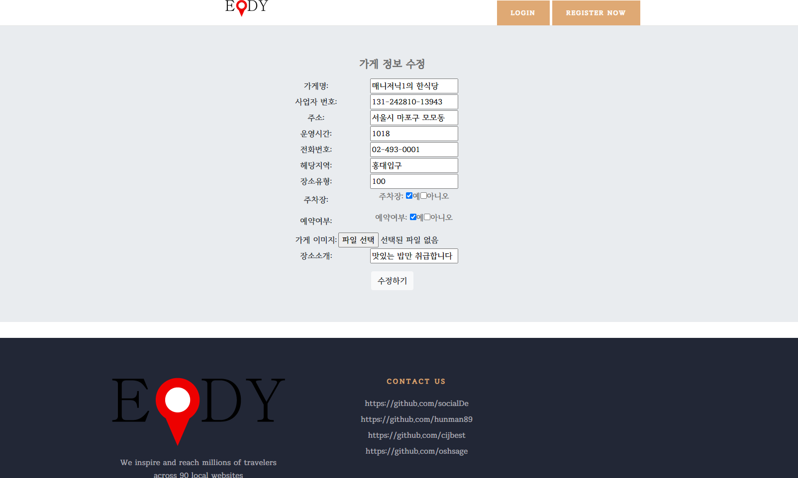

##### - 장소 상세 화면(예약 현황)

##### - 장소 상세 화면(리뷰 현황)

##### - 가게 현황(조회수, 평균 평점, 예약 수)

